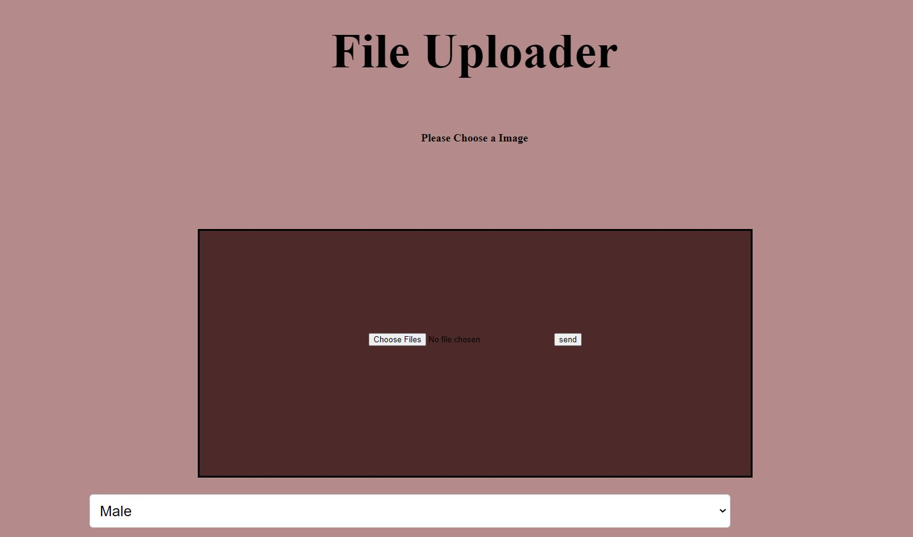
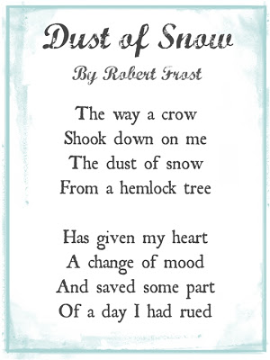
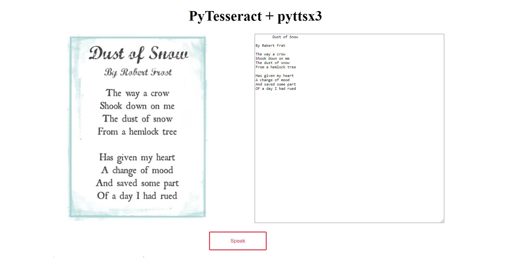

# Speech Extractor
## This project is based on python web app
## Framework: Flask
## Libraries: Pyttsx3, Pytesseract, os, flask,
## Steps to run this Web App
### Download this file and create seperate conda environment
### Install requirements.txt file by using command pip install -r requirements.txt
### After installation run the command python main.py

## Images of Web App 
## Front Page of Web app

## Photo to read by Web App

## Result:

